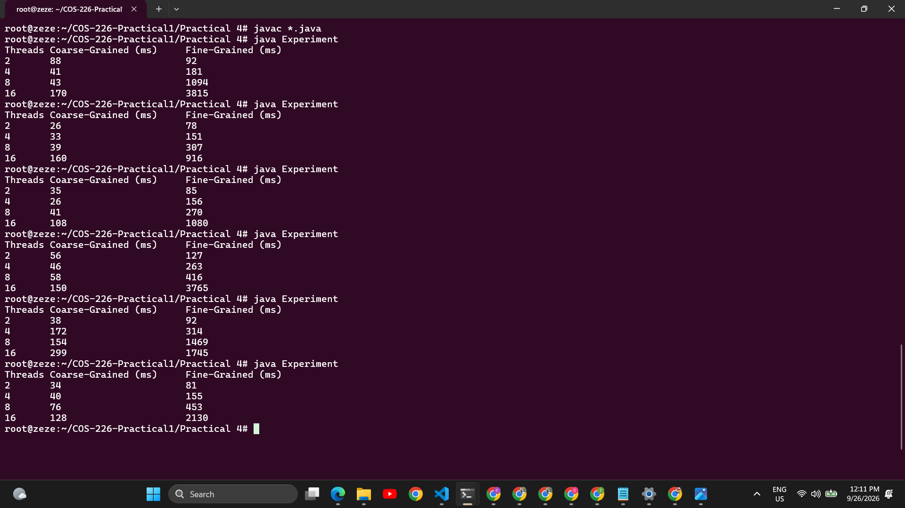

# COS 226 - Practical 4: Lock Granularity and Concurrent Lists

**Group members:**
- Zamokuhle Zwane (u23533413)
- Ashley Mthemba (u25072235)
- Thandolwethu Jantjies (u25114469)

## Overview

This practical implements and compares two concurrent sorted linked list designs:

- `CoarseList` - one global lock protects the entire list
- `FineList` - each node has its own lock, traversal uses hand-over-hand locking

Both support `add(int value)`, `remove(int value)`, and `contains(int value)` on a sorted set of integers.

## Files

- `Node.java` - shared node structure (value, next pointer, per-node ReentrantLock)
- `CoarseList.java` - Task 1, coarse-grained implementation
- `FineList.java` - Task 2, fine-grained implementation with hand-over-hand locking
- `Main.java` - original single-run test harness (unchanged)
- `Experiment.java` - Task 3, benchmarks both lists across multiple thread counts
- `README.md` - this file

## How to compile and run

All files must be in the same folder.

```
javac *.java
java Experiment
```

`Experiment` prints a table of execution times (ms) for `CoarseList` vs `FineList` at 2, 4, 8, and 16 threads, using the same mixed add/contains/remove workload as `Main`.

## Task 3 Results

Six runs on the same machine, same workload (1000 operations per thread):

| Threads | Coarse-Grained (ms) | Fine-Grained (ms) |
|---------|----------------------|---------------------|
| 2       | 38                   | 92                  |
| 4       | 46                   | 178                 |
| 8       | 68                   | 668                 |
| 16      | 169                  | 2225                |

(values above are rough averages across the six runs)

Raw console output from all six runs:



## Explanation of results

Fine-grained locking was slower than coarse-grained locking at every thread count, and the gap widened sharply as thread count increased.

Reasons:

- the workload assigns each thread its own disjoint value range: `value = (threadID * 1000) + (j % 1000)`. thread 0 handles 0-999, thread 1 handles 1000-1999, and so on
- because the list stays sorted, threads with higher IDs need to traverse further to reach their range
- as more threads run, the list grows to roughly `numThreads * 1000` nodes, so traversal distance scales directly with thread count
- in `FineList`, every node stepped over during traversal costs a lock and unlock call (hand-over-hand locking). with 16 threads this means thousands of lock operations per single add/remove/contains call
- `CoarseList` walks the same distance but only pays for one lock acquisition per operation, regardless of how many nodes it passes
- all threads also traverse through the same early nodes near `head`, so fine-grained locking creates contention right at the start of the list instead of spreading load out

Fine-grained locking is designed to pay off when operations touch different, independent parts of a structure with short traversals. This workload does the opposite: traversal length grows with thread count, and every operation passes through the same shared prefix of the list. The per-node locking overhead ends up outweighing any concurrency benefit.

## Conceptual notes for demonstration

- coarse-grained lock acquisition/release: single `lock.lock()` / `lock.unlock()` per operation in `CoarseList`, wrapped in try/finally
- hand-over-hand locking in `FineList`: lock `curr` before releasing `pred`, so no gap in protection exists during traversal
- neighbouring nodes must be locked simultaneously during add/remove so the predecessor's `next` pointer can be safely modified without another thread mutating the same region mid-operation