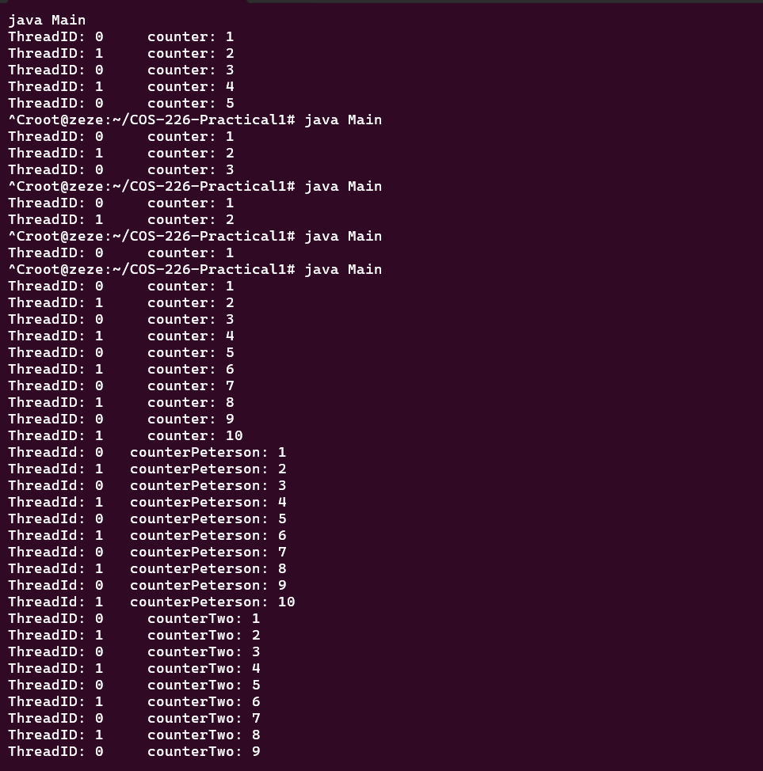
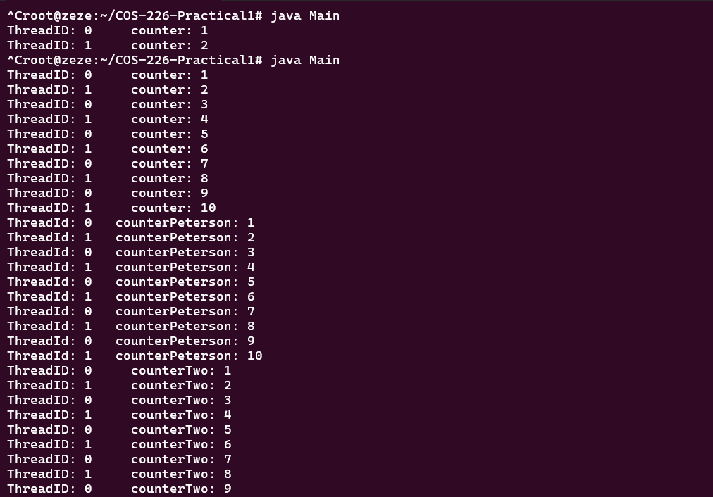
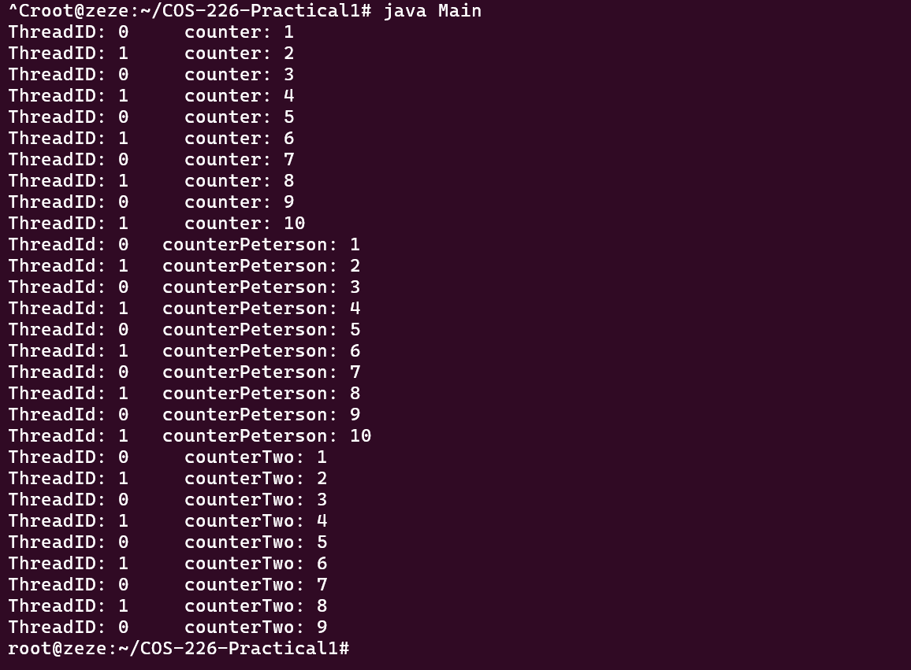

# COS 226 Practical 1: Mutual Exclusion Locks

Implementation of three mutual exclusion locking a;gorithms, namely LockOne, lockTwo and Peterson's, concurrent locking algorithms using two concurrent threads in Java.

---

## How to Run

**Step 1 Compile:**
```bash
javac Main.java LockOne.java PetersonsLock.java
```

**Step 2 Run:**
```bash
java Main
```

Or combine both into one command:
```bash
javac Main.java LockOne.java PetersonsLock.java; java Main
```
**Note:** LockOne and LockTwo are both expected to occasionally hang, see screenshot, this is meant to be a deliberate demo of their known flaws, its not a bug. If it hangs, we can just Ctrl + C to stop it

## Algorithms Demonstrated

This program runs two threads against three lock algorithms to compare
their behaviour under contention. Each thread repeats a small critical
section that increments a shared counter and prints progress, so mutual
exclusion (or failure of it) is directly visible in the output.

### 1. LockOne
`LockOne` uses a per-thread `flag[]` array. A thread sets its own flag to
`true` and then spins while the other thread's flag is `true`.

In this system, `LockOne` provides the first baseline example: it shows
the basic intent of mutual exclusion, but it can deadlock when both threads
raise their flags at the same time and then wait forever.

### 2. `doWork` with `LockOne`
`doWork(int myID)` is the worker routine used by both threads for the
`LockOne` demonstration. On each iteration it:
- calls `lock1.lock(myID)` before entering the critical section,
- increments the shared `counter`,
- prints the thread ID and current counter value,
- immediately calls `lock1.unlock(myID)`.

This function is where the lock is actually exercised. It cleanly marks
the critical section boundaries and makes lock behaviour observable in
real time.

### 3. Peterson's Lock
Combines `flag[]` (from LockOne) and a `victim` variable (from LockTwo) to
fix both failure modes above. Free of deadlock and starvation. This explanation is consistent with the textbook.

## Testing
We ran the program 8 times in a row to observe each lock's behaviour under real thread scheduling: 
see screenshow below







| Lock | Result |
|---|---|
| LockOne | Hung in 5 of 8 runs, at varying points, confirms it fails under contention |
| Peterson's Lock | Completed all 10 iterations in every run where it got to execute (8/8), never hung once |
| LockTwo | Hung at iteration 9 in every run where it got to execute, confirms it fails without contention |

This theoretically makes sense for each algorithm

## Note on run order

In the 'Main.java', The three locks ae tested one after another, meaning one locks threads will block the following locks from running at all in the same execution.

So i put Peterson's Lock is deliberately run between LockOne and LockTwo, so that if LockOne hangs, Peterson's Lock still gets a chance to demonstrate
its correctness before LockTwo's expected hang. Multiple runs are
recommended to observe all three algorithms in a single session.

Output order between ThreadID 0 and 1 is not guaranteed to be identical
across runs, since thread scheduling is non-deterministic.

Suggestsion: put Peterson's lock first so it runs without worrying about having to Ctrl + C each time LockOne hangs

## Reference

Herlihy, M., & Shavit, N. (2012). *The Art of Multiprocessor Programming*
(Revised 1st ed.). Morgan Kaufmann/Elsevier. ISBN: 978-0-12-397337-5

LockOne, LockTwo, and Peterson's Lock implementations are based on the
algorithms and analysis presented in this textbook (Ch. 2, pp. 24–27).